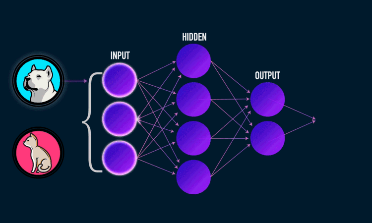

# Face_recognition
<div align="center">

</div>
Date: 2022/12/11

## Project Description 
In this repository i tryed to distinguish between two croped given faces with [neural network](https://youtube.com/playlist?list=PLZHQObOWTQDNU6R1_67000Dx_ZCJB-3pi) 

face recognition with machine learning in python

### Machine learning
[Machine learning](https://youtu.be/PeMlggyqz0Y) algorithms build a model based on sample data, known as training data, in order to make predictions or decisions without being explicitly programmed to do so.Machine learning algorithms are used in a wide variety of applications, such as in medicine, email filtering, speech recognition, and computer vision, where it is difficult or impossible to develop conventional algorithms to perform the needed tasks.

Some implementations of machine learning use data and neural networks in a way that mimics the working of a biological brain.In its application across business problems, machine learning is also referred to as predictive analytics.

### Neuran network
[Neural networks](https://youtube.com/playlist?list=PLZHQObOWTQDNU6R1_67000Dx_ZCJB-3pi) are designed to work just like the human brain does. In the case of recognizing handwriting or facial recognition, the brain very quickly makes some decisions. For example, in the case of facial recognition, the brain might start with “It is female or male? Is it black or white? Is it old or young? Is it your friend or not?





## Installation Dependencies:

* [Python 3](https://www.python.org/downloads/)
* [OpenCV-Python](https://packaging.python.org/en/latest/tutorials/installing-packages/)
* [matplotlib.pyplot](https://packaging.python.org/en/latest/tutorials/installing-packages/)

## Training
```
python training.py
```
data set : [2D face sets](http://pics.psych.stir.ac.uk/2D_face_sets.htm )

## Testing
```
python test.py
```


Testing the functionality of the program with a simpler goal.

Building a model that takes the angle input in radians and gives the sine of that angle.
```
python sin nn.py
```
## Contributions
Feel free to send your pull request or open issues.

whats machine learning 
   https://youtu.be/PeMlggyqz0Y

whats Neural network 
    https://youtube.com/playlist?list=PLZHQObOWTQDNU6R1_67000Dx_ZCJB-3pi

nn from scratch 
    https://www.youtube.com/watch?v=Wo5dMEP_BbI
